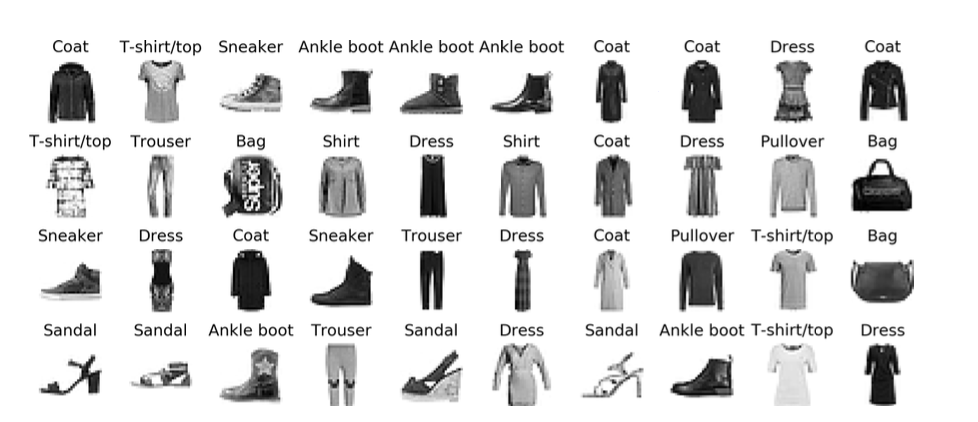

# Building an Image Classifier Using the Sequential API

### Fashion MNIST
Fashion MNIST is a drop-in replacement for MNIST. It has the same format as MNIST (70,000 grayscale images of 28 × 28 pixels each, with 10 classes), but the images represent fashion items rather than handwritten digits. Each class is more diverse, making the problem significantly more challenging than MNIST. For example, a simple linear model reaches about 92% accuracy on MNIST, but only about 83% on Fashion MNIST.

## Target Classes

